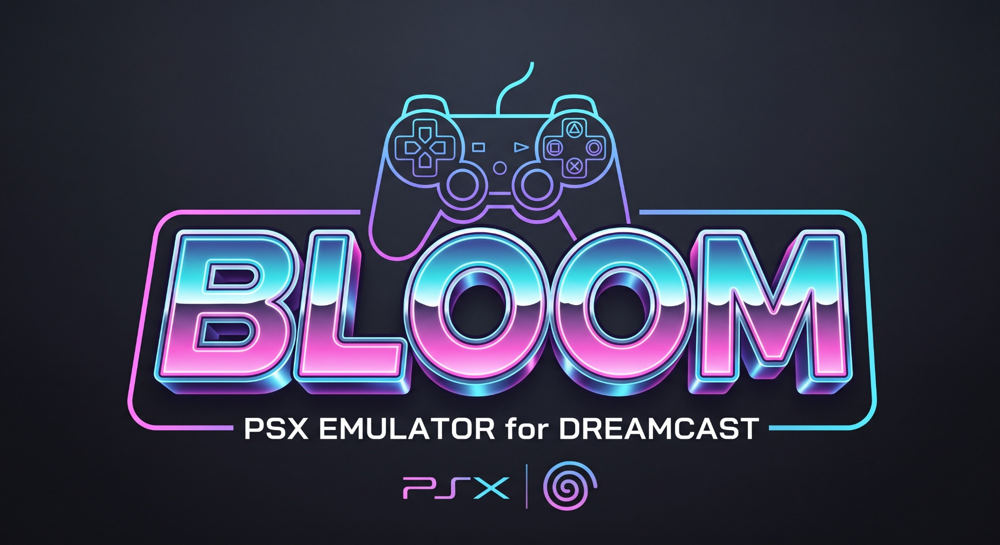

<p align="center">
  
</p>

<p align="center">
  <strong>PlayStation 1 emulator for the Sega Dreamcast</strong><br>
  <em>Alpha software — 2D can be playable, 3D is often too slow</em>
</p>

Bloom runs PlayStation software on Dreamcast hardware. It is a KallistiOS
port of [pcsx_rearmed](https://github.com/libretro/pcsx_rearmed) with
[Lightrec](https://github.com/pcercuei/lightrec) for the CPU, a custom
PowerVR renderer, and dfsound mixed out through the AICA.

It started as [pcercuei/bloom](https://github.com/pcercuei/bloom). See
[`ROADMAP.md`](ROADMAP.md) for what still needs to land.

## Status

| Area | Today |
| ---- | ----- |
| CPU | Lightrec JIT + GNU Lightning, playable for many titles |
| Disc | Original discs (including libcrypt), plus images from CD, IDE, or SD |
| GPU | PVR (default, faster) or Unai (software, more accurate) |
| Audio | dfsound mix streamed to the AICA (voices, XA, CDDA; reverb off) |
| Input | DualShock-style pad, analog, mouse, rumble |
| Saves | VMU memory cards; optional savestate load at boot |
| UX | Menu with Settings (persisted), last folder, load status; read-only Build info; no in-game pause |

## Features

**Discs and images**

- Hardware CD-ROM, including original discs and libcrypt titles
- BIN/CUE, CCD/IMG, MDS/MDF, ISO, PBP, and CHD (FLAC / LZMA / ZSTD)
- Load from the Dreamcast GD-ROM, an IDE hard drive, or an SD adapter

**BIOS and cards**

- [OpenBIOS](https://pcsx-redux.consoledev.net/openbios/) is packed in by default
- Official BIOS dumps can be used at runtime (`WITH_BIOS_PATH`) or embedded at build time
- Memory cards as VMU files, or as images on IDE / SD

**Graphics**

- PVR renderer (default): hardware-accelerated, lower compatibility
- Unai software renderer: slower, much closer to real GPU behavior
- Off-screen VRAM draws (triangles, sprites, lines) are rasterized in software
- Texture windows (GP0 E2) on sprites and wrapping triangles; 1:1 flipped-sprite UV inset
- Optional 480p, hybrid rendering, bilinear filtering, FSAA, and 24-bit framebuffer

**Audio**

- Default `SPU_PLUGIN=AICA`: pcsx_rearmed dfsound mixed on the SH-4, stereo S16 44100 through KOS `snd_stream`
- Voices, XA-ADPCM, CDDA, and SPU IRQs
- Reverb and Gaussian interpolation are off to save CPU
- `SPU_PLUGIN=Null`: same mixer, silent output (useful if a title misbehaves with playback)
- AICA playback waits for about 93 ms of mixed audio before starting, then
  fills shortages with silence. Sustained slow emulation can still cause gaps.

**Input and extras**

- Analog sticks, mouse, rumble
- Button combos for missing DualShock buttons (see [Controls](#controls))
- Optional savestate load at boot (`WITH_BOOT_SSTATE`)

## Known limitations

- **PVR still glitches** on some effects (hybrid rendering, remaining GPU holes). Use Unai when a title needs accurate drawing.
- **No in-game pause**, disc-swap UI, or savestate UI. Settings persist audio
  output, rumble, analog, 480p, bilinear, hybrid rendering, clipping, FSAA,
  and the last browse folder to `/sd/bloom.cfg`, `/ide/bloom.cfg`, or
  `/ram/bloom.cfg`. GPU plugin (PVR vs Unai) and 24-bit framebuffer stay
  compile-time. Options compiled out of a build show as “this build” and
  cannot be toggled. Build info remains a read-only summary.
- **3D is often far from full speed** (community reports around 30 fps 2D / 10 fps 3D).
- **Audio has no reverb** yet. If the AICA stream fails to start, dfsound falls back to silent output; IRQs still fire.
- Light gun and keyboard-as-controller are stubs.

## Controls

Dreamcast controller mapped as a DualShock-style pad. Hold **START** with another button to send the combo instead of Start.

| Dreamcast | PlayStation |
| --------- | ----------- |
| A | Cross |
| B | Circle |
| X | Square |
| Y | Triangle |
| L / R triggers | L1 / R1 |
| C / D | L2 / R2 |
| Z | Select |
| START | Start |
| START + A | Select |
| START + X / B | L3 / R3 |
| START + L / R | L2 / R2 |
| START + analog stick | Right analog (left stick is centered) |
| START + A+B+X+Y | Quit emulator |
| START + D-pad Up | Screenshot to `/pc` (dc-load only) |

Four controllers on ports A–D are presented as a multitap on PlayStation port 1. Rumble follows the Settings toggle and stops when that option is off.

## Building

You need current KallistiOS and a matching Dreamcast toolchain. GCC 15.1
builds with the default register allocator; CMake enables LRA only for
Lightrec's atomics and disables FMA contraction for the menu background.
Enabling `-mlra` globally with GCC 15.1 causes compiler failures in the
graphics code. Uploading with dc-tool also needs current dc-tool and dc-load.

See [the Docker toolchain notes](docs/docker-dreamcast.md) for the installed
development environment and reproducible build commands.

Required kos-ports: **Parallax** and **Tsunami** (menu).

```sh
cd /path/to/bloom
mkdir build && cd build
kos-cmake ..
make
```

That builds the defaults: PVR GPU, AICA audio, 480p, hybrid rendering, CHD, IDE, and SD.

`kos-ccmake` opens a curses UI with every option. Common flags:

| Option | Default | Notes |
| ------ | ------- | ----- |
| `GPU_PLUGIN` | `PVR` | `Unai` for the software renderer |
| `SPU_PLUGIN` | `AICA` | `Null` for silent dfsound (IRQs still emulated) |
| `WITH_480P` | ON | 640×480; off is 320×240 |
| `WITH_HYBRID_RENDERING` | ON | Turn off if a title glitches (reported for MGS) |
| `WITH_CHD` | ON | CHD images |
| `WITH_IDE` / `WITH_SDCARD` | ON | Hard drive / SD |
| `WITH_BILINEAR` | OFF | Texture filter |
| `WITH_FSAA` | OFF | Horizontal anti-aliasing |
| `WITH_24BPP` | OFF | 24-bit framebuffer, no dithering |
| `WITH_CLIPPING` | ON | Pixel clipping |
| `WITH_BOOT_SSTATE` | empty | Path to a savestate loaded at boot |
| `WITH_BIOS_PATH` | empty | Runtime BIOS file |
| `WITH_GAME_PATH` | empty | Auto-boot this disc image |
| `WITH_MCD1_PATH` / `WITH_MCD2_PATH` | `/dev/mcd0`, `/dev/mcd1` | Memory card images |

## Building a `1ST_READ.BIN`

Build Bloom normally, then:

```sh
kos-objcopy -O binary bloom.elf bloom.bin
${KOS_BASE}/utils/scramble/scramble bloom.bin 1ST_READ.BIN
```

Burn `1ST_READ.BIN` with BootDreams, or make a CDI with mkdcdisc. Passing
`bloom.elf` to mkdcdisc directly will not work.

## Debug builds

Full debug output (optimizer log, PSX disassembly, SH-4 disassembly) needs
Binutils in the KOS toolchain:

```sh
cd /path/to/bloom
deps/binutils/build.sh

mkdir build && cd build
kos-cmake -DCMAKE_BUILD_TYPE=Debug -DLOG_LEVEL=Debug ..
make
```

## Host regression checks

With Python 3 and Clang installed, run:

```sh
python3 tests/test_regressions.py
```

Or run the same checks in Docker from the repository root:

```sh
docker build -f tests/Dockerfile -t bloom-tests .
docker run --rm -v "$PWD:/workspace:ro" bloom-tests
```

These checks compile the complete production audio driver and dfsound output
selection, the VMU metadata/loading routines, the menu path/error helpers,
and settings parse/cycle,
with hardware calls stubbed out and address/undefined-behavior sanitizers
enabled. They cover audio startup, failure cleanup, silent fallback, reopening,
stereo ordering across overflow and wrapping, silent underruns, bounded save
titles, invalid icon counts, unsupported VMU ports, missing files, truncated
saves, disc-image extensions, volume labels, and CD load error strings. They do
not replace a KallistiOS build or testing on Dreamcast hardware.

PVR regression coverage also checks that disabled scanout continues drawing
sprites and lines into PSX VRAM without accumulating hardware polygons,
preserves drawing-area clipping, and resumes hardware rendering when enabled.
Texture-cache tests cover every single-pixel VRAM update and rectangles ending
at or crossing cache-block boundaries.
Sanitizer errors fail the test run.

### Flycast audio smoke test

`tests/audio_smoke.c` runs the production AICA output driver without the
PlayStation core or a game image. With a KallistiOS environment loaded, build
it from the repository root:

```sh
mkdir -p build
kos-cc -std=gnu11 -Wall -Wextra -Werror \
  -Ideps/pcsx_rearmed/plugins/dfsound \
  tests/audio_smoke.c src/aica_out.c -lm -o build/bloom-audio-smoke.elf
```

Open the ELF in Flycast. It plays three seconds of 440 Hz on the left and
660 Hz on the right, closes the driver, pauses, and repeats. Completion is
shown on screen; close the emulator when finished. Check both channels for
clear tones and listen for glitches, especially when playback restarts.

Both passes completed in Flycast 2.7 during development, and the listener
confirmed both rounds sounded clear. This checks initialization, stereo-tone
playback, shutdown, and reopening with the emulated AICA. Real Dreamcast
behavior and PlayStation mixer integration still require separate verification.

## Credits

Bloom is built on:

- [KallistiOS](https://github.com/KallistiOS/KallistiOS)
- [pcsx_rearmed](https://github.com/libretro/pcsx_rearmed)
- [Lightrec](https://github.com/pcercuei/lightrec)
- [GNU Lightning](https://www.gnu.org/software/lightning)
- [OpenBIOS](https://pcsx-redux.consoledev.net/openbios/)

Original Dreamcast port by [Paul Cercueil](https://github.com/pcercuei/bloom).

## License

GPL-2.0. See [`COPYING`](COPYING).
